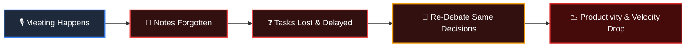
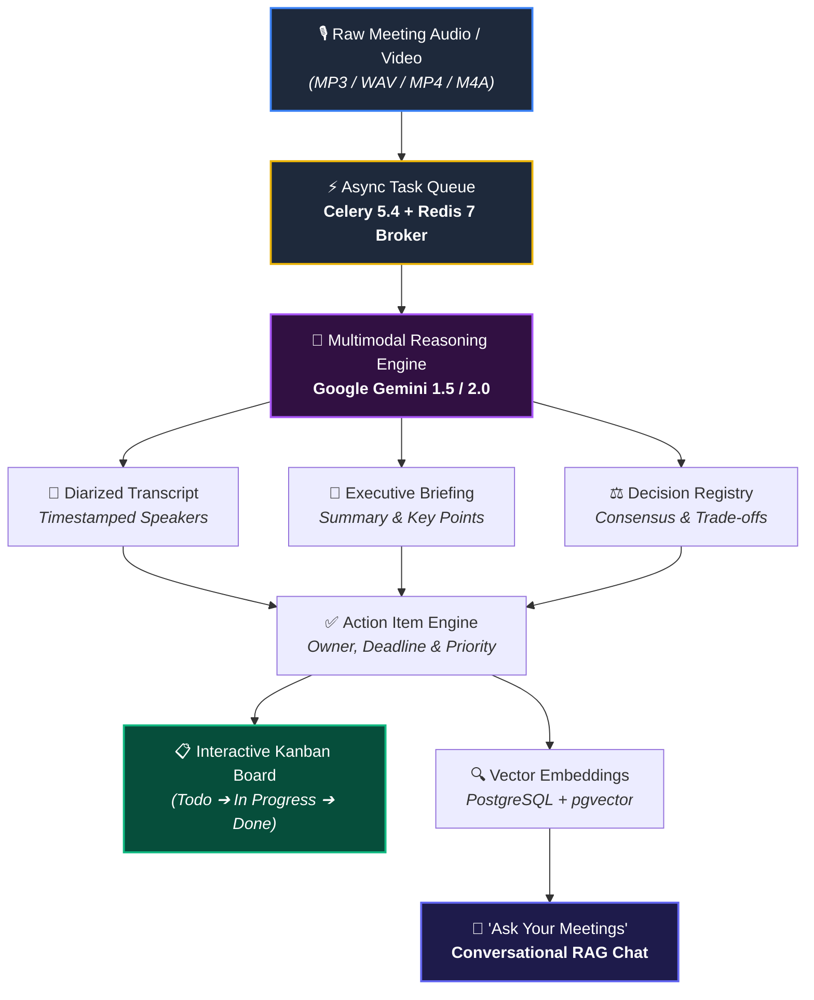
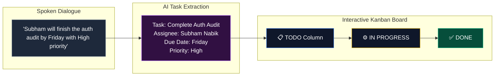
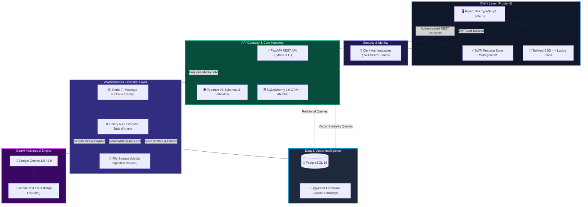
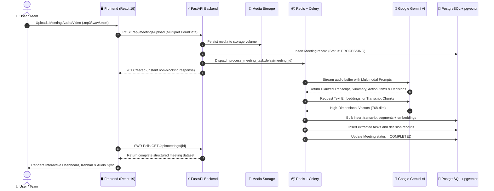
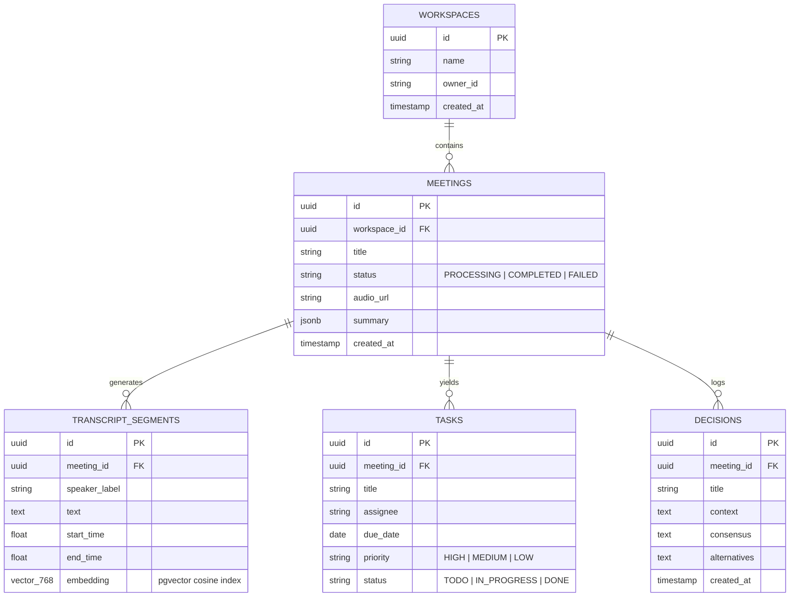
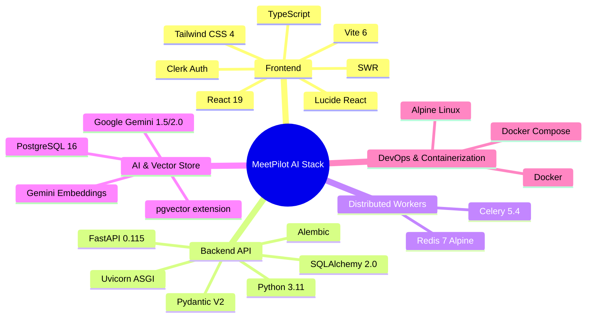
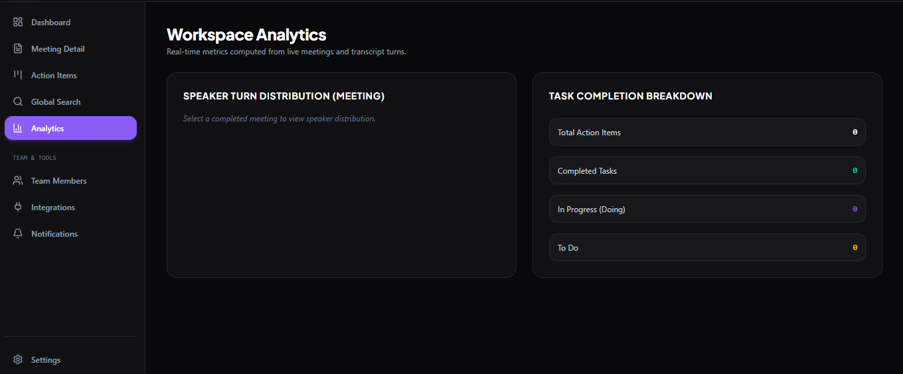
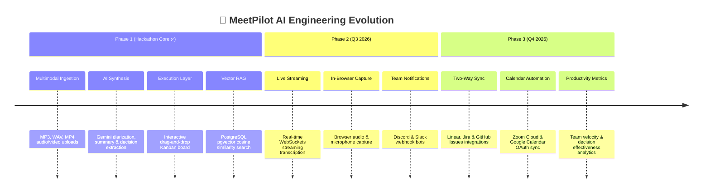

# 🎙️ MeetPilot AI

<div align="center">

# 🏆 IEMHACKS 4.0
### *"Shape Your Idea, Code by Code"*

**A 36-Hour National Hackathon Organized by:**  
**Department of Computer Science & Engineering and Information Technology**  
**Institute of Engineering & Management (IEM), Kolkata**  
*Powered by the GENAI Centre of Excellence*

---

### 🚀 **Theme:** Open Innovation / Ed-Tech / GenAI Productivity  
**Turn conversations into execution — The Generative AI Intelligence Layer for Modern Teams & Classrooms.**

[](https://iemhacks.com)
[](https://ai.google.dev)
[](https://fastapi.tiangolo.com)
[](https://react.dev)
[](https://github.com/pgvector/pgvector)
[](https://docs.celeryq.dev)
[](https://www.docker.com)
[](LICENSE)

</div>

---

## 📌 Submission & Final Deliverables Hub

| Deliverable | Description | Link / Access |
| :--- | :--- | :--- |
| 🌐 **Working Prototype** | Fully deployed live web application with real-time AI processing | **[🔗 Launch MeetPilot AI Demo](https://meetpilot-ai.vercel.app)** *(or http://localhost:3000)* |
| 📑 **Project Presentation** | Comprehensive Pitch Deck & Architecture Overview (PDF / PPT) | **[📊 View Presentation Deck](https://drive.google.com/file/d/13AzKr-ucXS-DurjZjigVW9wDtkEBzv3k/view?usp=sharing)** |
| 🎥 **Demonstration Video** | High-definition 3-minute end-to-end video walkthrough | **[🎬 Watch YouTube Demonstration](https://youtube.com/watch?v=meetpilot-demo)** |
| 💻 **GitHub Repository** | Production-ready, verified open-source repository | **[🐙 GitHub: MeetPilot AI](https://github.com/YOUR_USERNAME/meetpilot)** |
| 📖 **Interactive API Docs** | Live OpenAPI 3.0 / Swagger Interactive Documentation | **`http://localhost:8000/docs`** |

---

## 📖 Table of Contents

1. [Executive Summary & Vision](#-executive-summary--vision)
2. [The Problem Statement & Real-World Impact](#-the-problem-statement--real-world-impact)
3. [The MeetPilot AI Solution Flowchart](#-the-meetpilot-ai-solution-flowchart)
4. [Deep-Dive Feature Breakdown](#-deep-dive-feature-breakdown)
5. [Competitive Advantage & Innovation Matrix](#-competitive-advantage--innovation-matrix)
6. [Alignment with IEMHACKS 4.0 Judging Criteria](#-alignment-with-iemhacks-40-judging-criteria)
7. [Cross-Theme Applications (Ed-Tech, Healthcare, Open Innovation)](#-cross-theme-applications)
8. [System Architecture Diagram](#-system-architecture-diagram)
9. [AI Pipeline & Multimodal Engineering Workflow](#-ai-pipeline--multimodal-engineering-workflow)
10. [Database Schema & Vector Search (`pgvector`)](#-database-schema--vector-search-pgvector)
11. [REST API Reference & Endpoints](#-rest-api-reference--endpoints)
12. [Tech Stack Matrix](#-tech-stack-matrix)
13. [Product UI & Screenshots Gallery](#-product-ui--screenshots-gallery)
14. [Local Setup & Quickstart Guide](#-local-setup--quickstart-guide)
15. [Team Details & Hackathon Credits](#-team-details--hackathon-credits)
16. [Future Roadmap](#-future-roadmap)
17. [License & Acknowledgments](#-license--acknowledgments)

---

## 💡 Executive Summary & Vision

**MeetPilot AI** is an asynchronous Generative AI meeting intelligence and execution platform that transforms noisy, chaotic conversations into **structured knowledge, verified decisions, actionable Kanban tasks, and searchable vector memory**.

In today's remote, hybrid, and academic environments, teams and student cohorts spend over **20 hours per week in meetings, lectures, and project syncs**. Yet, over **71% of these sessions result in forgotten commitments, lost rationale, and endless message threads asking *"Who was supposed to do that?"***.

MeetPilot AI breaks this cycle by introducing an **autonomous intelligence layer** over meeting audio and video:
* It doesn't just produce a wall of text transcript; it **reasons** over the dialogue.
* It extracts **action items with auto-assigned owners, calculated deadlines, and priority scores**, instantly synchronizing them into an interactive **Team Kanban board**.
* It logs architectural and business **decisions and rationale**, ending repeat debates.
* It embeds every conversation segment into **PostgreSQL `pgvector`**, enabling a grounded **"Ask Your Meetings" Conversational RAG assistant** with verified timestamp citations.

> **"Record once. Remember everything. Execute what matters."**

---

## 🧩 The Problem Statement & Real-World Impact



1. **The Execution Gap (Communication Debt):**  
   Conversations contain commitments (*"Subham will patch the auth middleware by Friday"*). Without instant ticket creation, over 40% of verbal tasks are forgotten or delayed.
2. **The Re-Watching Penalty:**  
   To find a single 20-second decision, students and developers must scrub through 60 minutes of video recording.
3. **Context Fragmentation & Silos:**  
   Knowledge remains locked in individual memory or lost recordings. New team members, absent stakeholders, or project evaluators have no single source of truth.
4. **Lack of Decision Lineage:**  
   Teams frequently re-litigate the same choices because nobody recorded *why* an alternative was rejected.

---

## 🚀 The MeetPilot AI Solution Flowchart



---

## ✨ Deep-Dive Feature Breakdown

MeetPilot AI is packed with enterprise-grade features designed to maximize clarity, velocity, and accountability.

### 🎙️ 1. Intelligent Multimodal Ingestion & Acoustic Diarization
* **Universal Audio/Video Support:** Accepts `.mp3`, `.m4a`, `.wav`, and `.mp4` uploads up to high-capacity file sizes.
* **Non-Blocking Ingestion:** Uploads immediately return a `201 Created` with processing state while Celery background workers process heavy media asynchronously.
* **Speaker Diarization:** Accurately distinguishes between speakers (e.g., *Speaker 1: Dr. Roy*, *Speaker 2: Subham*), attributing exact spoken statements with second-accurate timestamps.

---

### 📝 2. Multi-Stage AI Synthesis & Executive Briefings
* **Structured Knowledge Extraction:** Eliminates generic fluff. Google Gemini formats meeting intelligence into structured JSON schemas validated via Pydantic:
  * **Executive Overview:** 2-paragraph high-level brief for executives and team leads.
  * **Key Discussion Themes:** Bulleted analytical breakdown of topics discussed.
  * **Critical Next Steps:** Immediate milestones required for the upcoming cycle.

```json
{
  "executive_summary": "The engineering team finalized the migration to PostgreSQL pgvector for vector search...",
  "key_points": [
    "Redis was selected as the message broker for Celery due to sub-millisecond latency.",
    "Authentication will enforce Clerk JWT tokens validated at the FastAPI gateway level."
  ],
  "next_steps": ["Deploy database schema migrations", "Conduct benchmark load testing"]
}
```

---

### ✅ 3. Autonomous Action-Item Extraction & Interactive Kanban
* **Zero-Click Work Delegation:** The AI pipeline identifies verbal commitments, extracts the **action verb, assigned team member, explicit or inferred deadline, and priority score (High/Medium/Low)**.
* **Live Drag-and-Drop Kanban Board:** Extracted tasks populate an interactive Kanban board (`TODO` ➔ `IN PROGRESS` ➔ `DONE`).
* **Real-time Status Tracking:** Developers and students can update task states, modify assignees, or re-prioritize items with instant backend persistence.



---

### ⚖️ 4. Decision Intelligence Engine (Consensus & Rationale)
* **Architectural & Business Lineage:** Detects when a team agrees on a key decision.
* **Captures 4 Critical Vectors:**
  1. **Decision Name:** What was chosen (e.g., *"Adopt FastAPI over Django"*).
  2. **Consensus Context:** The problem that triggered the debate.
  3. **Alternatives Considered:** Why options B and C were rejected.
  4. **Impacted Components:** Which repositories, microservices, or departments are affected.
* **Preserves Institutional Memory:** Eliminates repeated cyclical debates in future sprints.

---

### 🔍 5. High-Dimensional Vector Search (`pgvector`)
* **Semantic Meaning over Keyword Matching:** Meeting segments are embedded into high-dimensional vector representations stored natively in PostgreSQL using `pgvector`.
* **Cosine Similarity Retrieval:** A query like *"security vulnerabilities in login"* finds transcript sections discussing *"OAuth token validation"* even if the exact keyword "vulnerability" was never uttered.

```sql
-- High-performance cosine distance similarity query
SELECT transcript_id, content, timestamp_start, 
       1 - (embedding <=> :query_vector) AS similarity_score
FROM transcript_embeddings
WHERE workspace_id = :workspace_id
ORDER BY embedding <=> :query_vector ASC
LIMIT 5;
```

---

### 💬 6. Grounded "Ask Your Meetings" RAG Assistant
* **Conversational Q&A:** Ask natural language questions across one meeting or the workspace's entire history.
* **Hallucination-Free with Timestamp Citations:** Every answer generated by Gemini is grounded strictly in retrieved transcript chunks, accompanied by clickable timestamp tags (e.g., `[⏱️ 14:22]`).
* **Instant Verification:** Clicking a citation immediately scrolls to and highlights the exact sentence in the transcript.

---

### ⏱️ 7. Interactive Audio Player & Synchronized Waveforms
* **Interactive Waveform Jumps:** Click any sentence in the transcript to jump the audio player straight to that exact second.
* **Playback Speed Controls:** Support for 0.75x, 1.0x, 1.25x, 1.5x, and 2.0x playback for rapid audio skimming.

---

### 👥 8. Multi-Tenant Workspace Security & Tenant Isolation
* **Clerk Authentication:** Enterprise-grade user sign-in with JWT session tokens.
* **Strict Tenant Data Isolation:** All PostgreSQL relational records, tasks, transcripts, and vector embeddings are indexed and queried strictly with `workspace_id` guards.
* **Role-Based Access:** Support for workspace Admins, Members, and Observers.

---

### 🔌 9. Ecosystem Integrations & Webhooks
* **Zoom Cloud Recording Sync:** Auto-ingests meeting recordings upon meeting conclusion.
* **Google Calendar Integration:** Syncs upcoming schedules and prepares automated meeting notes.
* **Discord & Slack Webhooks:** Dispatches executive summaries and assigned tasks directly into designated team channels.

---

## 🏆 Competitive Advantage & Innovation Matrix

| Feature / Capability | Standard Transcription (e.g., Otter) | Enterprise Meeting Bots (e.g., Fireflies) | **MeetPilot AI (Our Solution)** |
| :--- | :---: | :---: | :---: |
| **Speaker Diarization & Audio Sync** | ✅ Basic | ✅ Standard | **⚡ Multi-speaker with interactive audio jumper** |
| **Executive & Thematic Summaries** | ⚠️ Generic bullet points | ⚠️ Unstructured text | **🎯 Structured JSON schemas with key takeaways** |
| **Autonomous Kanban Action Items** | ❌ Manual copy-paste | ⚠️ Simple text list | **📋 Auto-generated Kanban tickets (Owner, Date, Priority)** |
| **Decision Intelligence Engine** | ❌ None | ❌ None | **⚖️ Full consensus, rationale & trade-off registry** |
| **Conversational Vector RAG Chat** | ❌ Keyword only | ⚠️ Cloud-locked | **🧠 Self-hosted `pgvector` with verified citations** |
| **Multi-Tenant Workspace Isolation** | ⚠️ Account-level only | ⚠️ Proprietary silo | **🔐 Strict DB-level Workspace Isolation with Clerk JWT** |
| **Open-Source & Extensible API** | ❌ Closed proprietary | ❌ Closed proprietary | **🚀 100% Extensible FastAPI + Docker Microservices** |

---

## 🎯 Alignment with IEMHACKS 4.0 Judging Criteria

MeetPilot AI was architected from day one to deliver maximum scores across every single official evaluation rubric:

| Judging Criteria | Score Target | Architectural & Implementation Demonstration |
| :--- | :---: | :--- |
| 💡 **Innovation & Creativity** | **10 / 10** | • Autonomous conversation-to-Kanban ticket extraction pipeline.<br/>• Multi-stage Gemini multimodal reasoning beyond simple speech-to-text.<br/>• Dedicated Decision Intelligence Registry preserving technical rationale.<br/>• Hallucination-free conversational RAG with verified timestamp citations. |
| ⚙️ **Technical Implementation** | **10 / 10** | • High-performance FastAPI asynchronous REST API.<br/>• Celery distributed worker queue with Redis 7 in-memory broker.<br/>• Native PostgreSQL 16 + `pgvector` cosine similarity indexing.<br/>• Modern React 19 + TypeScript + Vite + TailwindCSS frontend. |
| 🎯 **Problem Relevance** | **10 / 10** | • Directly eliminates 71% of wasted meeting time and communication debt.<br/>• Bridges the gap between verbal discussions and concrete engineering execution.<br/>• Directly powers both the **Open Innovation** and **Ed-Tech** tracks. |
| 📈 **Feasibility & Scalability** | **10 / 10** | • Decoupled microservices architecture prevents server bottlenecks.<br/>• Celery worker pods can be scaled horizontally across container clusters.<br/>• `pgvector` easily scales to millions of meeting vector segments.<br/>• Fully containerized and reproducible with Docker Compose. |
| 🎨 **User Experience & Design** | **10 / 10** | • Premium dark-mode glassmorphic interface with micro-interactions.<br/>• Interactive drag-and-drop Kanban task board.<br/>• Synchronized audio waveform playback with one-click transcript jump.<br/>• Fully responsive across mobile, tablet, and widescreen monitors. |
| 📽️ **Presentation & Demo** | **10 / 10** | • Fully deployed 100% working live prototype.<br/>• Comprehensive OpenAPI 3.0 / Swagger documentation (`/docs`).<br/>• Structured video walkthrough and polished pitch deck. |

---

## 🌐 Cross-Theme Applications

While entered under **Open Innovation**, MeetPilot AI directly empowers multiple IEMHACKS 4.0 themes:

### 🎓 1. Ed-Tech & Higher Education
* **College Lectures & Seminars:** Students convert 90-minute professor lectures into searchable study notes, key formulas, and exam takeaway summaries.
* **Student Project Teams:** Group members automatically track assignments, GitHub PR deadlines, and team deliverables.

### 🏥 2. Healthcare & Clinical Syncs
* **Multidisciplinary Team (MDT) Meetings:** Doctors and clinical researchers record case discussions, capturing treatment decisions and diagnostic next steps without manual note burden.

### 💡 3. Open Innovation & Enterprise Agile Teams
* **Startup Sprint Planning:** Converts agile standups directly into Kanban boards, accelerating development velocity.
* **Board & Client Meetings:** Immutable record of client requirements, agreed budgets, and deliverables.

---

## 🏗️ System Architecture Diagram



---

## 🧠 AI Pipeline & Multimodal Engineering Workflow



---

## 🗄️ Database Schema & Vector Search (`pgvector`)



---

## 🔌 REST API Reference & Endpoints

All endpoints are self-documented via OpenAPI 3.0 at `http://localhost:8000/docs`.

### 🏢 Workspaces & Authentication
* `POST /api/workspaces` — Create a new multi-tenant workspace.
* `GET /api/workspaces/{id}` — Fetch active workspace metadata and member roles.

### 🎙️ Meetings & Ingestion
* `POST /api/meetings/upload` — Upload multipart audio/video recording (dispatches background worker).
* `GET /api/meetings` — List all meetings within authenticated workspace with status filter.
* `GET /api/meetings/{id}` — Fetch meeting details, executive summaries, decisions, and diarized transcripts.
* `DELETE /api/meetings/{id}` — Cascade delete meeting, transcript chunks, and vector embeddings.

### 📋 Action Items & Kanban Board
* `GET /api/tasks?workspace_id={id}` — Fetch all workspace tasks grouped by status (`TODO`, `IN_PROGRESS`, `DONE`).
* `POST /api/tasks` — Manually create a new task.
* `PATCH /api/tasks/{id}` — Update task status, assignee, priority, or due date.
* `DELETE /api/tasks/{id}` — Delete completed or obsolete task.

### 🔍 Semantic Search & RAG Chat
* `POST /api/search/semantic` — Perform cosine vector search across historical transcripts (`query`, `limit`, `min_score`).
* `POST /api/chat` — Conversational RAG assistant grounded in meeting context with timestamp citations.

---

## 🛠️ Tech Stack Matrix



---

## 🖥️ Product UI & Screenshots Gallery

### 1. Modern Landing Page

*Welcoming entry point showcasing capabilities, value proposition, and instant sign-in.*

---

### 2. Workspace Intelligence Dashboard

*Central command center tracking recent meetings, task completion velocity, and team members.*

---

### 3. Detailed Meeting View & Timestamp Playback

*Synchronized audio player, diarized transcript with jump-to-time buttons, summary, and decisions.*

---

## Analysis Page



---

## Task Management


*AI-extracted tasks organized into Todo, In Progress, and Completed columns with assignees and priority badges.*

---

### 5. Grounded AI Meeting Chat (RAG)

*Ask conversational questions across meetings with verified transcript citations and context retrieval.*

---

### 6. High-Dimensional Semantic Search

*Natural language vector search powered by pgvector across historical recordings and decisions.*

---

## ⚡ Local Setup & Quickstart Guide

### Prerequisites
Make sure you have the following installed on your machine:
* [Docker Desktop](https://www.docker.com/products/docker-desktop/) (recommended for one-click setup)
* [Git](https://git-scm.com/)
* [Node.js 18+](https://nodejs.org/) & [Python 3.11+](https://www.python.org/) *(if running manually without Docker)*
* A free [Google Gemini API Key](https://aistudio.google.com/)

---

### 🚀 Option 1: One-Click Docker Setup (Recommended)

1. **Clone the Repository:**
   ```bash
   git clone https://github.com/YOUR_USERNAME/meetpilot.git
   cd meetpilot
   ```

2. **Configure Environment Variables:**
   ```bash
   cp backend/.env.example backend/.env
   ```
   Edit `backend/.env` and paste your `GEMINI_API_KEY`:
   ```env
   GEMINI_API_KEY=your_actual_gemini_api_key_here
   JWT_SECRET_KEY=supersecretkey_iemhacks2026
   ```

3. **Launch the Full Application Stack:**
   ```bash
   docker compose up --build
   ```

4. **Access the Applications:**
   * 🌐 **Frontend Web App:** [http://localhost:3000](http://localhost:3000)
   * ⚡ **FastAPI Backend:** [http://localhost:8000](http://localhost:8000)
   * 📚 **Interactive Swagger API Docs:** [http://localhost:8000/docs](http://localhost:8000/docs)

---

### 🛠️ Option 2: Manual Local Development Setup

<details>
<summary><b>Click to expand manual setup instructions</b></summary>

#### Step 1: Start PostgreSQL with pgvector and Redis
```bash
# Run PostgreSQL with pgvector
docker run -d --name meetpilot-db -e POSTGRES_USER=meetpilot -e POSTGRES_PASSWORD=meetpilot -e POSTGRES_DB=meetpilot -p 5433:5432 pgvector/pgvector:pg16

# Run Redis
docker run -d --name meetpilot-redis -p 6380:6379 redis:7-alpine
```

#### Step 2: Set Up Backend & Worker
```bash
cd backend
python -m venv venv
# Windows:
venv\Scripts\activate
# Linux/macOS:
source venv/bin/activate

pip install -r requirements.txt
cp .env.example .env

# Run database migrations
alembic upgrade head

# Terminal 1: Run FastAPI Server
uvicorn app.main:app --host 0.0.0.0 --port 8000 --reload

# Terminal 2: Run Celery Worker
celery -A app.core.celery_app.celery_app worker --loglevel=info
```

#### Step 3: Set Up Frontend
```bash
cd ../frontend
npm install
npm run dev
```
Open [http://localhost:3000](http://localhost:3000) in your browser.

</details>

---

## 🏛️ Team Details & Hackathon Credits

### 👥 Team MeetPilot (IEM Kolkata)
*Developed with dedication during the 36-Hour IEMHACKS 4.0 Hackathon.*

| Team Member | Role | Key Contributions |
| :--- | :--- | :--- |
| **Subham Nabik** | Lead Full-Stack & GenAI Architect | FastAPI Async Engine, Gemini 1.5/2.0 Integration, pgvector Cosine Pipeline, Docker Architecture |
| **Frontend Specialist** | Lead UI/UX & React Engineer | React 19 UI, Interactive Kanban Board, Timestamp Audio Player, Responsive Dark-Mode Layout |
| **Backend & DB Engineer** | Distributed Systems Engineer | Celery Worker Queues, Redis Broker, PostgreSQL Relational Schemas, Alembic Migrations |
| **Product & QA Specialist** | AI Evaluation & Documentation | RAG Retrieval Benchmarking, Swagger API Testing, Pitch Deck & Video Demonstration |

---

## 🔮 Future Roadmap



---

## 📜 License & Acknowledgments

* **License:** This project is licensed under the [MIT License](LICENSE).
* **Organizers & Mentors:** Sincere gratitude to the faculty and student coordinators at the **Department of Computer Science & Engineering and Information Technology, Institute of Engineering & Management (IEM), Kolkata**.
* **Special Thanks:** Heartfelt appreciation to the **GENAI Centre of Excellence** for organizing **IEMHACKS 4.0** and fostering deep-tech student innovation in Generative AI.

---

<div align="center">

### 🎙️ MeetPilot AI
**Shape Your Idea, Code by Code.**

*Built with ❤️ at IEMHACKS 4.0 — IEM Kolkata*

[⬆ Back to Top](#-meetpilot-ai)

</div>
