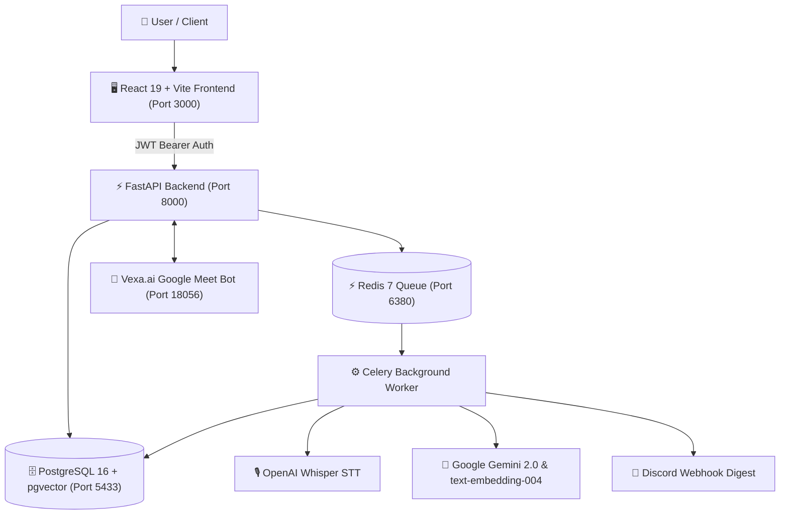

# 🎙️ MeetPilot AI

> **Autonomous meeting intelligence & execution platform.**  
> Turn live calls and audio recordings into structured summaries, action items with assignees, decision registries, and searchable vector memory.

[](https://fastapi.tiangolo.com)
[](https://react.dev)
[](https://github.com/pgvector/pgvector)
[](https://ai.google.dev)
[](https://www.docker.com)
[](LICENSE)

---

## ⚡ Core Features

- 🤖 **Autonomous Live Google Meet Capture**: Dispatches a headless Playwright bot (powered by Vexa.ai) into Google Meet rooms to record and stream audio.
- 🎙️ **Speech-to-Text & Speaker Diarization**: Local OpenAI Whisper transcription with acoustic speaker segmentation and timestamp alignment.
- 🧠 **Gemini 2.0 Single-Pass Synthesis**: Generates an executive overview, key takeaways, next steps, consensus decisions, and action items in one fast LLM pass.
- 🔍 **pgvector Semantic Search & RAG Chat**: Indexes transcripts with 768-dimensional `text-embedding-004` vectors for context-grounded conversational Q&A with audio timestamp citations.
- 📋 **Action Items & Kanban Board**: Extracted commitments automatically turn into tasks (`todo`, `doing`, `done`) with assigned owners, priorities, and deadlines.
- 🏢 **Multi-Tenant Workspaces & Clerk Auth**: Clerk SSO (Google, GitHub, Slack) with workspace isolation, member roles, and cascade data management.
- 🔔 **External Integrations & Notifications**: Automated post-meeting Discord webhook digests, Zoom cloud sync, and in-app real-time status alerts.

---

## 🏗️ Architecture



---

## 🛠️ Tech Stack

| Component | Technology | Purpose |
| :--- | :--- | :--- |
| **Frontend** | React 19, TypeScript, TailwindCSS v4, Lucide Icons, SWR | Responsive SPA dashboard & real-time UI |
| **Backend API** | Python 3.11+, FastAPI, Pydantic v2, SQLAlchemy 2.0 | Async REST API & authentication |
| **Database** | PostgreSQL 16 + `pgvector` | Relational tables & 768-dim vector embeddings |
| **Task Queue** | Celery 5.4 + Redis 7 | Asynchronous meeting processing pipeline |
| **AI / LLM** | Google Gemini 2.0 Flash (`google-genai`) | Single-pass intelligence extraction & RAG chat |
| **Embeddings** | Google `text-embedding-004` (768-dim) | Dense vector representations for semantic search |
| **Transcription** | OpenAI Whisper (`base`/`small`) | Local speech recognition & speaker diarization |
| **Auth** | Clerk (`@clerk/clerk-react` + PyJWT / JWKS) | Multi-provider SSO & JWT verification |
| **Live Bot** | Vexa.ai (Playwright + MinIO + WebSockets) | Autonomous Google Meet recording & capture |

---

## 🚀 Quickstart Guide

### Prerequisites
- [Docker & Docker Compose](https://docs.docker.com/get-docker/) installed and running.
- A [Google Gemini API Key](https://aistudio.google.com/app/apikey).
- (Optional) [Clerk](https://clerk.com) keys for authentication.

### 1. Clone & Configure Environment

```bash
git clone https://github.com/unnkarm/meetpilot.git
cd meetpilot
```

Copy the example environment files and configure your keys:

```bash
# Backend .env
cp backend/.env.example backend/.env
```

Ensure `GEMINI_API_KEY` is set in `backend/.env`.

### 2. Run with Docker Compose (Recommended)

Start all services (Postgres + pgvector, Redis, FastAPI Backend, Celery Worker, React Frontend):

```bash
docker compose up -d
```

Once running, access the services:
- **Frontend Dashboard**: `http://localhost:3000`
- **FastAPI Docs (Swagger)**: `http://localhost:8000/docs`
- **PostgreSQL**: `localhost:5433` (User/Password: `meetpilot` / `meetpilot`)
- **Redis**: `localhost:6380`

### 3. Manual Local Development (Optional)

<details>
<summary><b>Run Backend & Frontend without Docker</b></summary>

#### Backend
```bash
cd backend
python -m venv .venv
source .venv/bin/activate  # Windows: .venv\Scripts\activate
pip install -r requirements.txt
python -m alembic upgrade head
uvicorn app.main:app --reload --port 8000
```

#### Celery Worker
```bash
cd backend
celery -A app.core.celery_app.celery_app worker --loglevel=info
```

#### Frontend
```bash
cd frontend
npm install
npm run dev
```
</details>

---

## 📁 Repository Structure

```
meetpilot/
├── backend/
│   ├── alembic/                 # Database migrations
│   ├── app/
│   │   ├── api/routes/          # REST API endpoints (meetings, live, tasks, chat, search)
│   │   ├── core/                # Settings, security, encryption, rate limiter
│   │   ├── database/            # SQLAlchemy session & Base
│   │   ├── models/              # DB models (Meeting, User, Workspace, Task, Decision)
│   │   ├── schemas/             # Pydantic request/response schemas
│   │   ├── services/            # Gemini client, Whisper, Vexa, Discord, Zoom
│   │   └── workers/             # Celery processing tasks
│   ├── Dockerfile
│   └── requirements.txt
├── frontend/
│   ├── src/
│   │   ├── components/          # AppWorkspace, LiveMeetingModal, Navbar, Hero
│   │   ├── services/            # SWR fetchers & API client
│   │   └── types.ts             # TypeScript interfaces
│   ├── Dockerfile
│   └── package.json
├── docs/                        # In-depth feature & architecture specifications
│   ├── Architecture.md
│   ├── PRD.md
│   └── features/                # Individual feature documentation
├── docker-compose.yml
└── README.md
```

---

## 📚 Detailed Documentation

For in-depth guides and architectural specifications, see the [`docs/`](./docs) folder:
- [System Architecture](./docs/Architecture.md)
- [Product Requirements Document (PRD)](./docs/PRD.md)
- [Feature Guides & Technical Reference](./docs/features/README.md)

---

## 📄 License

This project is licensed under the MIT License — see the [LICENSE](LICENSE) file for details.
