# 🎙️ MeetPilot AI

> **Autonomous meeting intelligence & execution platform.**
> Turn live calls and audio recordings into structured summaries, action items with assignees, decision registries, and searchable vector memory.

[](https://fastapi.tiangolo.com)
[](https://react.dev)
[](https://github.com/pgvector/pgvector)
[](https://ai.google.dev)
[](https://huggingface.co/inference-endpoints)
[](https://www.docker.com)
[](LICENSE)

---

## 🌐 Live Deployment

- **Frontend:** [meetpilot-ai-agent.vercel.app](https://meetpilot-ai-agent.vercel.app/)
- **Backend API:** [meetpilot-backend-ol99.onrender.com](https://meetpilot-backend-ol99.onrender.com)
- **Interactive API Docs:** `https://meetpilot-backend-ol99.onrender.com/docs`
- **Video Submission:** [Drive](https://drive.google.com/drive/folders/1G2DZwZ7MtY9S4W61XHeZ-zZi6tSsHYzu)

---

## 💡 The Problem

Teams and student cohorts spend a large share of their week in meetings, lectures, and project syncs — and a lot of what gets said in them doesn't survive the meeting. Commitments made out loud ("I'll patch the auth middleware by Friday") don't turn into tickets on their own. Finding the one decision that mattered means scrubbing through an hour of recording. Knowledge stays locked in whoever was in the room, and teams re-debate choices because nobody wrote down *why* an alternative was rejected.

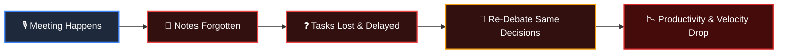

MeetPilot AI closes that gap: it doesn't just transcribe a meeting, it reasons over the dialogue — extracting owned, dated, prioritized action items; logging decisions and the rationale behind them; and making the whole archive searchable by meaning, not just keywords.

---

## ⚡ Core Features

- 🎙️ **Multi-Source Ingestion**: Upload recordings (MP3/WAV/M4A/MP4), record directly in-browser via the mic, import Zoom cloud recordings, or autonomously capture live Google Meet calls with a headless bot.
- 🤖 **Autonomous Live Google Meet Capture**: A Playwright-based bot (powered by self-hosted [Vexa.ai](https://github.com/Vexa-ai/vexa)) joins Google Meet rooms and streams live transcript data back into the platform.
- 🧾 **Self-Hosted Transcription & Diarization**: A custom [faster-whisper](https://github.com/SYSTRAN/faster-whisper) (large-v3 / large-v3-turbo) + [pyannote 4.0](https://huggingface.co/pyannote) diarization pipeline, deployed as a single-pass Hugging Face Inference Endpoint, with automatic fallback to Google Gemini if the endpoint is unconfigured, times out, or errors.
- 🧠 **Gemini 2.0 Single-Pass Synthesis**: Generates a structured executive overview, key takeaways, next steps, consensus decisions, and action items in one LLM pass, validated against a Pydantic schema — not a wall of unstructured text:

  ```json
  {
    "executive_summary": "The team finalized the migration to pgvector for vector search...",
    "key_points": [
      "Redis was selected as the Celery broker for its low latency.",
      "Auth will enforce Clerk JWT tokens validated at the FastAPI gateway."
    ],
    "next_steps": ["Deploy schema migrations", "Run load testing"]
  }
  ```

- ⚖️ **Decision Intelligence Engine**: Detects when a team reaches consensus and captures four things, not just the outcome: the decision itself, the context that triggered the debate, the alternatives that were considered and why they lost, and which parts of the system are affected — so teams stop re-litigating settled choices.
- 🔍 **pgvector Semantic Search & RAG Chat**: Indexes transcripts with 768-dimensional `text-embedding-004` vectors for context-grounded conversational Q&A, grounded strictly in retrieved transcript chunks with clickable audio timestamp citations — answers don't wander off what was actually said.
- ⏱️ **Interactive Audio Playback**: Click any sentence in the transcript to jump the audio player to that exact second, with variable playback speed (0.75x–2.0x) for fast review.
- 📋 **Action Items & Kanban Board**: Extracted commitments automatically become tasks (`todo`, `doing`, `done`) with assigned owners, priorities, and due dates — backed by a single aggregated workspace-tasks endpoint to avoid N+1 queries, with optimistic UI updates and automatic rollback on network failure.
- 🏢 **Multi-Tenant Workspaces & Clerk Auth**: Clerk SSO (Google, GitHub, Slack, email) with strict workspace-level data isolation enforced at the query level, and Owner/Admin/Member roles.
- 🔔 **External Integrations**: Automated post-meeting Discord webhook digests and Zoom cloud recording sync.

> **Note:** Google Calendar sync and live bot support for Zoom/Teams are built but gated behind OAuth app registrations that require a stable production domain — see [Roadmap](#-roadmap). Confirm Zoom cloud sync's OAuth setup is actually live in this environment before relying on it in production; it was flagged mid-project as pending real redirect-URI registration.

---

## 🆚 How This Differs from Standard Meeting Tools

| Capability | Standard Transcription Tools | Enterprise Meeting Bots | **MeetPilot AI** |
| :--- | :---: | :---: | :---: |
| Speaker Diarization | Basic | Standard | Multi-speaker with interactive audio jumper |
| Summaries | Generic bullet points | Unstructured text | Structured JSON schema with key takeaways |
| Action Items | Manual copy-paste | Simple text list | Auto-generated Kanban tickets (owner, date, priority) |
| Decision Tracking | None | None | Full consensus, rationale & trade-off registry |
| Semantic Search / RAG | Keyword only | Often cloud-locked | Self-hosted pgvector with verified citations |
| Workspace Isolation | Account-level only | Proprietary silo | Strict DB-level isolation with Clerk JWT |
| Extensibility | Closed | Closed | Open FastAPI + Docker, self-hostable end to end |

---

## 🌍 Use Cases

- **Engineering & Product Teams** — sprint planning and standups turn directly into Kanban tickets; architectural decisions get logged with the reasoning intact.
- **Education** — lectures and seminars become searchable notes and takeaway summaries; project teams track deliverables and deadlines automatically.
- **Client & Board Meetings** — an accurate record of requirements, budgets, and agreed deliverables, without relying on someone's manual notes.

---

## 🏗️ Architecture

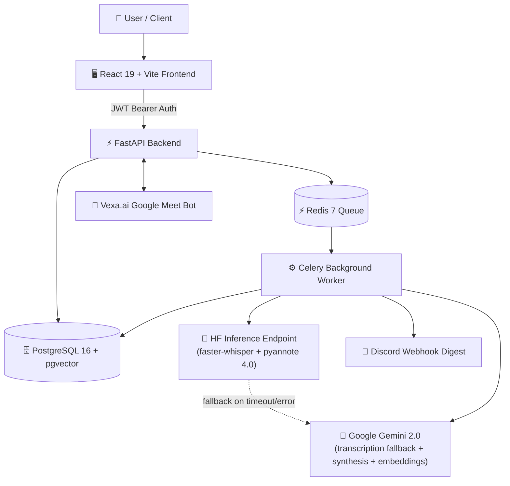

### AI Processing Sequence

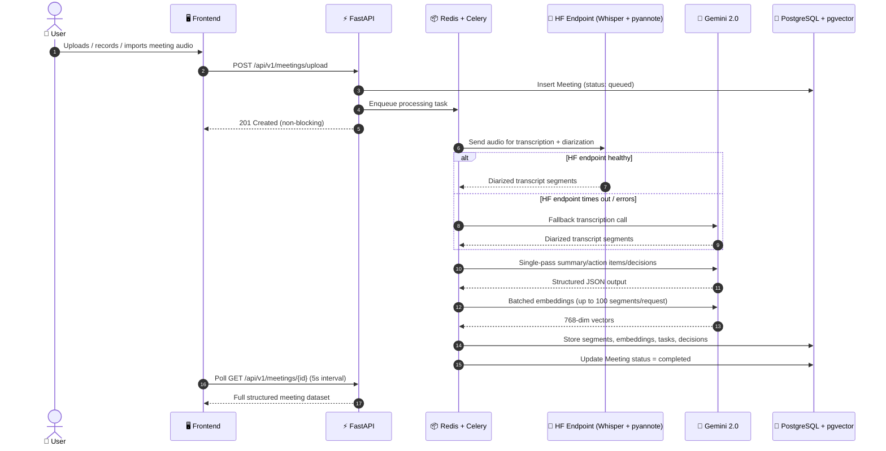

---

## 🗄️ Database Schema

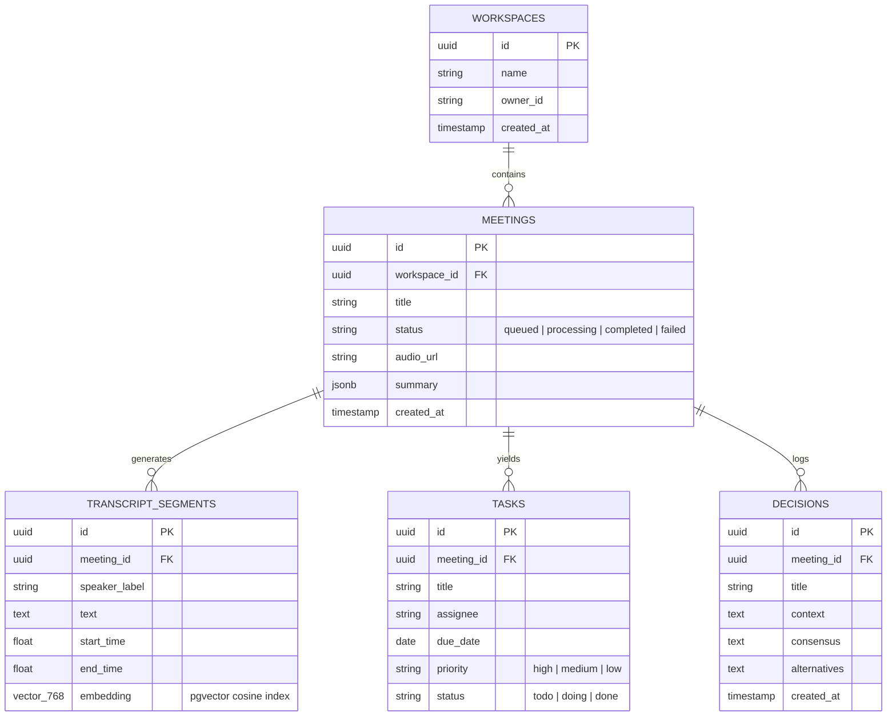

---

## 🔌 REST API Reference

Full interactive reference is auto-generated at `/docs` (OpenAPI 3.0 / Swagger). Key endpoints:

### Workspaces & Auth
- `GET /api/v1/auth/me` — current user session
- `POST /api/v1/workspaces` / `GET /api/v1/workspaces` — create / list workspaces
- `GET /api/v1/workspaces/{id}/members` / `POST /api/v1/workspaces/{id}/invite`

### Meetings
- `POST /api/v1/meetings/upload` — upload audio/video (multipart)
- `GET /api/v1/meetings?workspace_id={id}` — list meetings
- `GET /api/v1/meetings/{id}` — meeting detail & status
- `GET /api/v1/meetings/{id}/transcript` / `/summary` / `/decisions` / `/tasks`
- `GET /api/v1/meetings/{id}/audio` — tenant-authorized audio streaming
- `POST /api/v1/meetings/{id}/retry` — re-queue after a rate-limit/network failure without re-uploading
- `DELETE /api/v1/meetings/{id}`

### Tasks
- `GET /api/v1/tasks?workspace_id={id}` — aggregated workspace tasks (single query, no N+1)
- `POST /api/v1/tasks` / `PATCH /api/v1/tasks/{id}`

### Search & RAG
- `GET /api/v1/search?q={query}&workspace_id={id}` — global semantic search, 300ms debounced
- `POST /api/v1/meetings/{id}/chat` / `GET /api/v1/meetings/{id}/chat` — grounded Q&A with timestamp citations

> Note: earlier project drafts referenced un-versioned paths like `/api/meetings/...` — this project's actual routes are versioned under `/api/v1/...`; verify against your live `/docs` if you find a mismatch anywhere.

---

## 🛠️ Tech Stack

| Component | Technology | Purpose |
| :--- | :--- | :--- |
| **Frontend** | React 19, TypeScript, TailwindCSS v4, Lucide Icons, SWR | Responsive SPA dashboard & real-time UI |
| **Backend API** | Python 3.11+, FastAPI, Pydantic v2, SQLAlchemy 2.0 | Async REST API & authentication |
| **Database** | PostgreSQL 16 + `pgvector` | Relational tables & 768-dim vector embeddings |
| **Task Queue** | Celery 5.4 + Redis 7 | Asynchronous meeting processing pipeline |
| **Transcription & Diarization** | Self-hosted faster-whisper (large-v3/turbo) + pyannote 4.0, via Hugging Face Inference Endpoints; falls back to Gemini 2.0 | Primary speech-to-text and speaker diarization |
| **AI / LLM** | Google Gemini 2.0 Flash (`google-genai`) | Single-pass summary/action-item/decision extraction, RAG chat, transcription fallback |
| **Embeddings** | Google `text-embedding-004` (768-dim), batched up to 100 segments/request | Dense vector representations for semantic search |
| **Live Meeting Capture** | Vexa.ai (self-hosted; Playwright + MinIO + WebSockets) | Autonomous Google Meet recording & real-time transcript streaming |
| **Auth** | Clerk (`@clerk/clerk-react` + PyJWT / JWKS) | Multi-provider SSO & JWT verification |
| **Rate Limiting** | Redis-backed sliding-window limiter, Celery exponential backoff with jitter | Stays under Gemini free-tier RPM/TPM ceilings |

---

## 🚀 Quickstart Guide

### Prerequisites
- [Docker & Docker Compose](https://docs.docker.com/get-docker/)
- A [Google Gemini API Key](https://aistudio.google.com/app/apikey)
- A [Hugging Face account + access token](https://huggingface.co/settings/tokens) with the pyannote diarization model's gated terms accepted
- (Optional) [Clerk](https://clerk.com) keys for authentication
- (Optional) A deployed [Vexa](https://github.com/Vexa-ai/vexa) instance for live Google Meet capture

### 1. Clone & Configure Environment

```bash
git clone https://github.com/unnkarm/meetpilot.git
cd meetpilot
cp backend/.env.example backend/.env
```

Set at minimum in `backend/.env`:

```env
GEMINI_API_KEY=your_gemini_api_key
HF_ENDPOINT_URL=your_hf_inference_endpoint_url
HF_API_TOKEN=your_hf_access_token
HF_ENDPOINT_TIMEOUT_SECONDS=120
VEXA_API_KEY=your_vexa_api_key       # only needed for live Meet capture
```

### 2. Run with Docker Compose (Recommended)

```bash
docker compose up -d
```

- **Frontend Dashboard**: `http://localhost:3000`
- **FastAPI Docs (Swagger)**: `http://localhost:8000/docs`
- **PostgreSQL**: `localhost:5433` (`meetpilot` / `meetpilot`)
- **Redis**: `localhost:6380`

### 3. Manual Local Development (Optional)

<details>
<summary><b>Run Backend & Frontend without Docker</b></summary>

#### Backend
```bash
cd backend
python -m venv .venv
source .venv/bin/activate  # Windows: .venv\Scripts\activate
pip install -r requirements.txt
python -m alembic upgrade head
uvicorn app.main:app --reload --port 8000
```

#### Celery Worker
```bash
cd backend
celery -A app.core.celery_app.celery_app worker --loglevel=info
```

#### Frontend
```bash
cd frontend
npm install
npm run dev
```
</details>

---

## 📁 Repository Structure

```
meetpilot/
├── backend/
│   ├── alembic/                 # Database migrations
│   ├── app/
│   │   ├── api/routes/          # REST endpoints (meetings, live, tasks, chat, search)
│   │   ├── core/                # Settings, security, encryption, rate limiter
│   │   ├── database/            # SQLAlchemy session & Base
│   │   ├── models/               # DB models (Meeting, User, Workspace, Task, Decision)
│   │   ├── schemas/              # Pydantic request/response schemas
│   │   ├── services/             # Gemini client, HF endpoint client, Vexa, Discord, Zoom
│   │   └── workers/               # Celery processing tasks
│   ├── Dockerfile
│   └── requirements.txt
├── hf_endpoint/
│   ├── handler.py               # Custom faster-whisper + pyannote inference handler
│   ├── requirements.txt
│   └── test_handler.py
├── frontend/
│   ├── src/
│   │   ├── components/          # AppWorkspace, LiveMeetingModal, Navbar, Hero
│   │   ├── services/             # SWR fetchers & API client
│   │   └── types.ts
│   ├── Dockerfile
│   └── package.json
├── docs/
│   ├── Architecture.md
│   ├── PRD.md
│   └── features/
├── docker-compose.yml
└── README.md
```

---

## 🖼️ Screenshots

### Dashboard

Workspace overview — recent meetings, pending action items, and live workspace stats.

### Meeting Detail — Executive Summary & Decisions
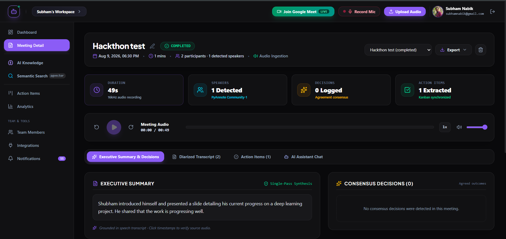
Single-pass Gemini synthesis, grounded in the transcript, with a synced audio player.

### Meeting Detail — Key Takeaways & Next Steps
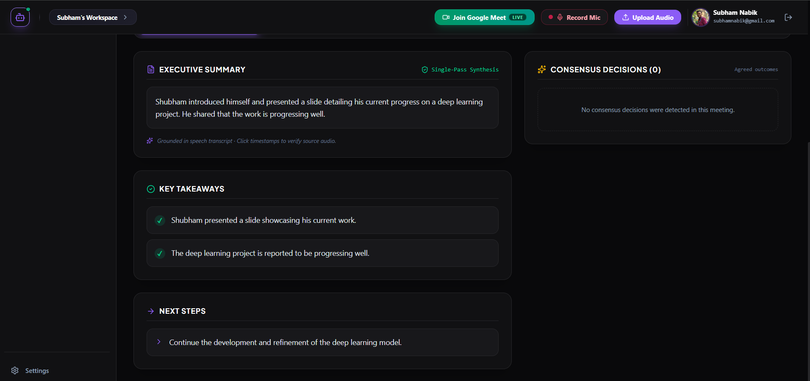

### Diarized Transcript
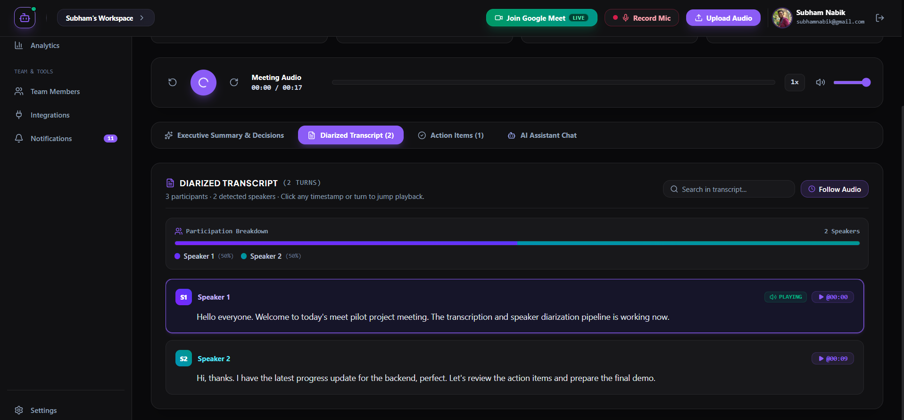
Speaker-labeled turns with participation breakdown and click-to-seek timestamps.

### Action Items (per meeting)
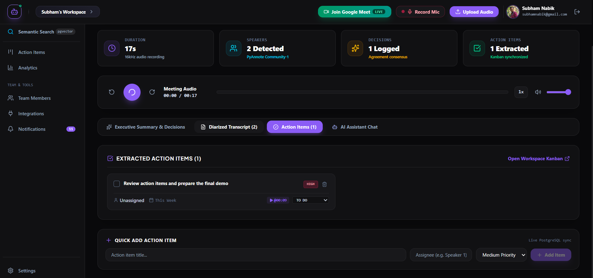

### Workspace AI Assistant (RAG Chat)
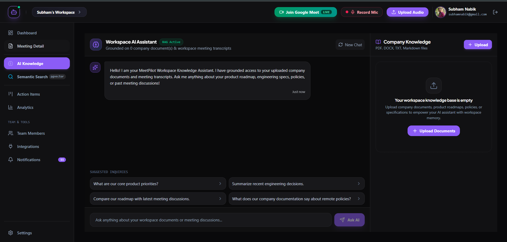
Grounded on workspace meeting transcripts and uploaded company documents.

### Workspace Semantic Search
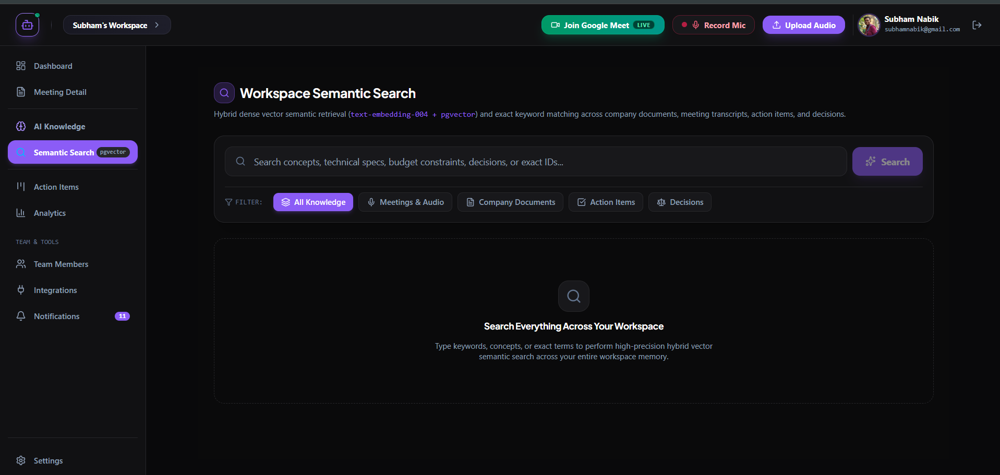
Hybrid dense-vector + keyword search across meetings, documents, action items, and decisions.

### Action Items Kanban Board


### Workspace Analytics
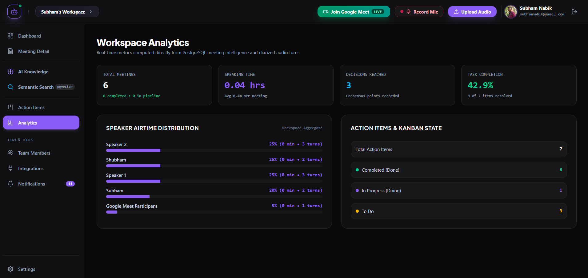

### Integrations


### Live Google Meet Capture — Consent Flow
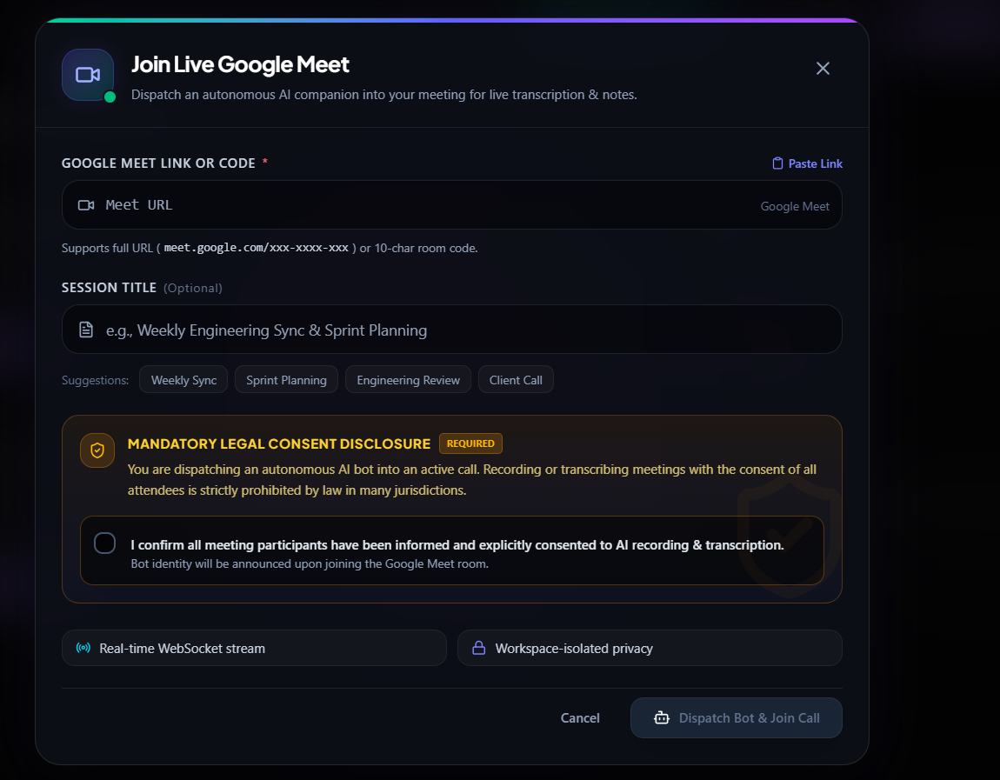
Mandatory consent confirmation before the bot joins a live call, per the legal/product requirement from this project's Vexa integration.

---

## 🔮 Roadmap

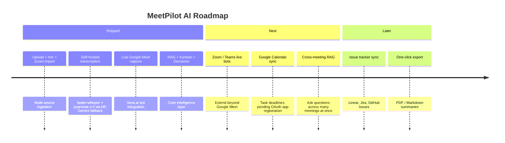

---

## 📄 License

This project is licensed under the MIT License — see the [LICENSE](LICENSE) file for details.