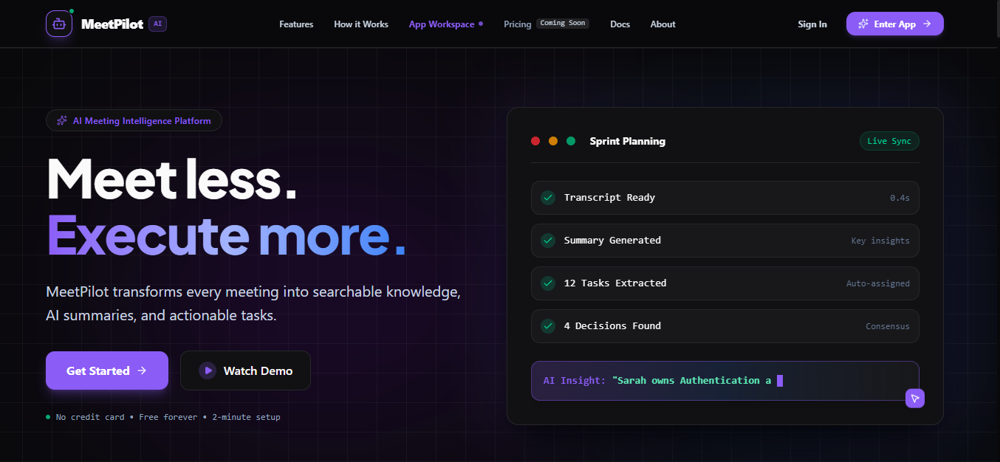
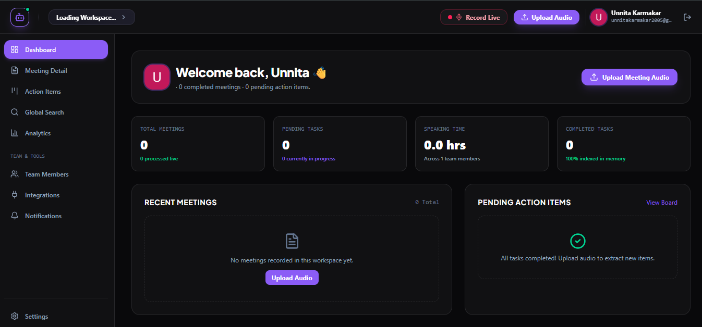
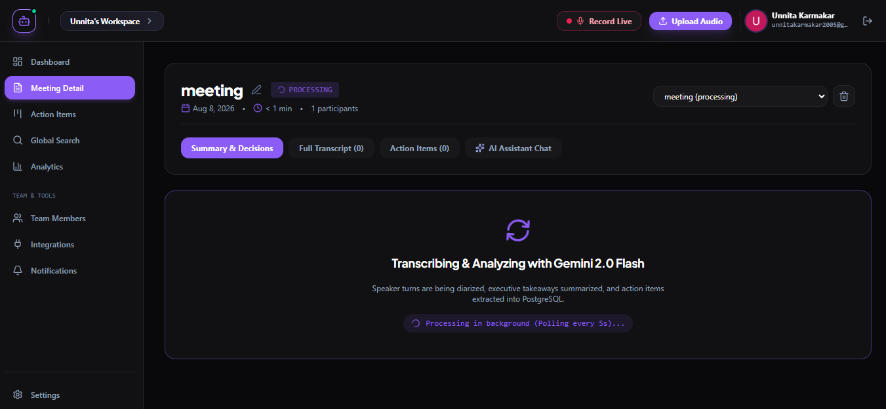
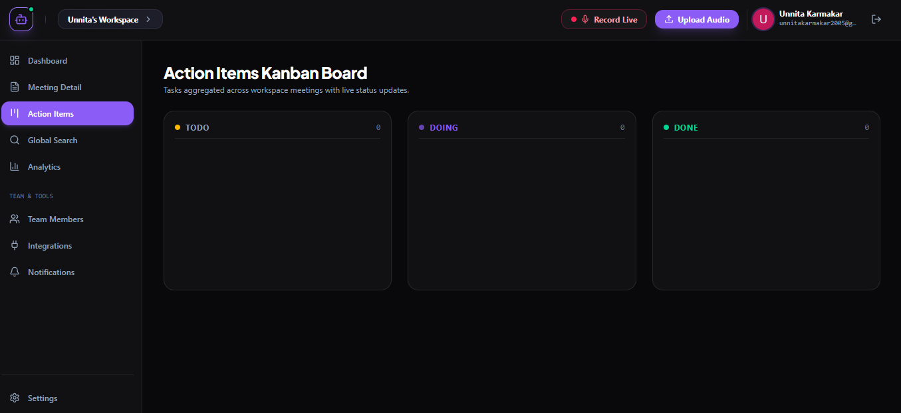
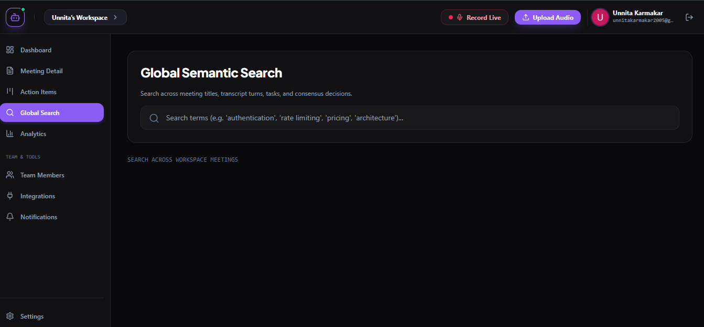
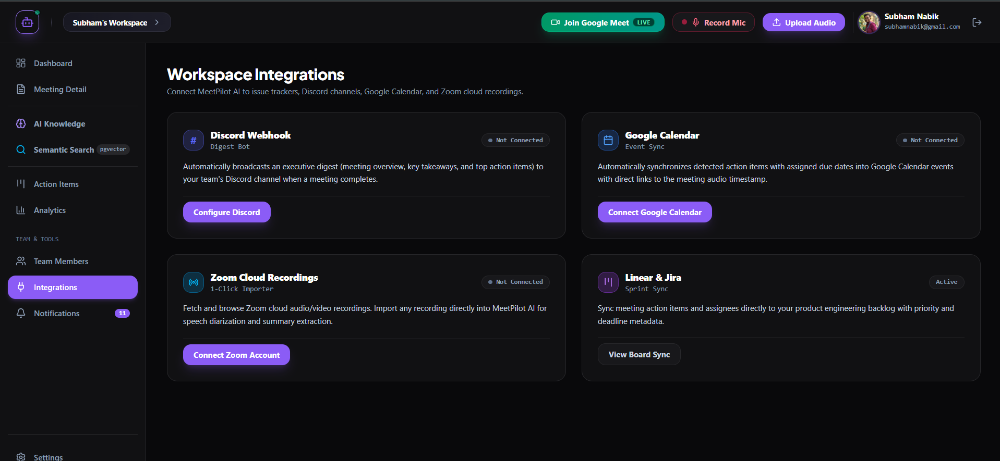

# 🎙️ MeetPilot AI

### From conversations to execution.

**MeetPilot AI** is an AI-powered meeting intelligence platform that transforms messy meeting conversations into **structured knowledge, decisions, and actionable work**.

Instead of leaving teams with a recording nobody watches and notes nobody updates, MeetPilot listens to meetings, understands what happened, identifies **who needs to do what and by when**, and turns the entire conversation into a searchable source of truth.

> **Record once. Remember everything. Execute what matters.**

---

## 🚀 Live Demo

### 🌐 Deployed Application

**[🔗 Try MeetPilot AI Live](YOUR_DEPLOYED_LINK_HERE)**

> Replace `YOUR_DEPLOYED_LINK_HERE` with your actual frontend deployment URL.

---

## 🚀 Pitch Deck

**[🔗 Meetpilot Pitch Deck](YOUR_DEPLOYED_LINK_HERE)**

---

## 🧩 The Problem

Meetings are where decisions are made.

But after the meeting:

* Important decisions get forgotten.
* Action items disappear into chat messages.
* Nobody remembers who was supposed to do what.
* Teams re-watch recordings to find a single sentence.
* Project context gets scattered across meetings, documents and messages.
* New team members have no easy way to recover historical context.

### The result?

**Meetings create information — but teams still struggle to turn that information into execution.**

---

## 💡 Our Solution

MeetPilot AI acts as an **intelligence layer for your meetings**.

### One meeting → an entire structured workspace

```text
                🎙️ Meeting
                    │
                    ▼
            🤖 AI Processing
                    │
       ┌────────────┼────────────┐
       ▼            ▼            ▼
   📝 Transcript  🧠 Summary   ⚖️ Decisions
       │            │            │
       └────────────┼────────────┘
                    ▼
              ✅ Action Items
                    │
          ┌─────────┼─────────┐
          ▼         ▼         ▼
       👤 Owner   📅 Due     🚦 Priority
                    │
                    ▼
             📋 Team Kanban
                    │
                    ▼
          🔎 Searchable Memory
```

MeetPilot doesn't just tell you **what was said**.

It tells you:

> **What happened → What was decided → What needs to happen next → Who owns it.**

---

# ✨ Key Features

## 🎙️ Intelligent Meeting Processing

Upload a meeting recording and let MeetPilot handle the rest.

* Audio/video meeting ingestion
* Background processing
* Automatic transcription
* Speaker diarization
* Timestamped transcript
* Processing status tracking

---

## 📝 AI-Powered Meeting Summaries

Every meeting is automatically transformed into a concise knowledge artifact.

### Generated automatically:

* Executive overview
* Key takeaways
* Next steps
* Important discussion points
* Decisions and consensus

No more manually writing meeting notes.

---

## ✅ Automatic Action-Item Extraction

MeetPilot identifies commitments made during conversations and turns them into structured tasks.

Each task can contain:

* Task description
* Assignee
* Due date
* Priority
* Status

### Example

> "Sarah will finish the authentication audit by Friday."

becomes:

```text
┌────────────────────────────────────┐
│ 🔐 Complete authentication audit   │
│                                    │
│ 👤 Sarah Chen                      │
│ 📅 Friday                          │
│ 🚦 High Priority                   │
│ 📋 Todo                            │
└────────────────────────────────────┘
```

---

## 📋 Team Kanban

All extracted action items can be managed from a centralized workspace.

```text
TODO                 DOING              DONE

┌──────────────┐    ┌──────────────┐   ┌──────────────┐
│ Fix OAuth    │    │ API Refactor │   │ DB Migration │
│              │    │              │   │              │
│ Sarah        │    │ Alex         │   │ Marcus       │
│ High         │    │ Medium       │   │ High         │
└──────────────┘    └──────────────┘   └──────────────┘
```

Tasks can be updated, assigned, prioritized and tracked directly inside MeetPilot.

---

## ⚖️ Decision Intelligence

Meetings contain more than tasks.

They contain **decisions**.

MeetPilot extracts consensus decisions from conversations so teams can quickly answer:

> "What did we actually decide?"

This creates a persistent record of important technical, product and business decisions.

---

## 🧠 Meeting Memory

MeetPilot turns historical meetings into a searchable knowledge base.

Every transcript segment can be embedded and stored using vector search.

This allows teams to search across their meeting history instead of manually opening recordings.

### Example

```text
🔎 "Why did we choose PostgreSQL?"

                    ↓

MeetPilot searches historical
meeting knowledge

                    ↓

📌 Relevant conversation found

                    ↓

🎙️ "During the architecture meeting..."

⏱️ 24:18
```

---

## 💬 Ask Your Meetings

MeetPilot provides conversational AI over meeting history.

Ask questions like:

```text
"What did we decide about authentication?"

"Who owns the database migration?"

"When did we discuss the pricing model?"

"What were the concerns about the new architecture?"
```

The AI retrieves relevant transcript context before answering, helping keep responses grounded in the actual meeting.

---

## 🔊 Timestamp-Aware Playback

The transcript isn't just text.

Transcript segments retain timestamps, allowing users to jump directly to the relevant part of the recording.

**Search → Find context → Jump to the exact moment.**

---

## 🔎 Semantic Search

Search across:

* Meetings
* Transcripts
* Tasks
* Decisions

Powered by vector embeddings and PostgreSQL `pgvector`.

This allows semantic queries rather than relying purely on keyword matching.

---

## 👥 Workspace Collaboration

MeetPilot is designed for teams rather than individual note-taking.

Workspaces support:

* Multiple members
* Invitations
* Team roles
* Workspace-level data isolation
* Shared meetings
* Shared tasks
* Shared meeting memory

---

## 🔗 Integrations

MeetPilot is designed to fit into an existing team workflow.

### Currently supported integrations include:

* 🎥 Zoom cloud recordings
* 📅 Google Calendar
* 💬 Discord
* 🔌 Integration management

Meetings can become the starting point for downstream team execution rather than another isolated tool.

---

# 🖥️ Product Screenshots

> Add your actual screenshots to a `screenshots/` directory and update the filenames below.

## Landing Page



---

## Dashboard



---

## Meeting Intelligence



---

## AI Meeting Chat


---

## Task Management



---

## Semantic Search



---

## Integrations



---

# 🏗️ System Architecture

```text
                         ┌─────────────────────┐
                         │      Frontend       │
                         │    React + Vite     │
                         └──────────┬──────────┘
                                    │
                              Clerk JWT
                                    │
                                    ▼
                         ┌─────────────────────┐
                         │      FastAPI        │
                         │    REST Backend     │
                         └──────────┬──────────┘
                                    │
                  ┌─────────────────┼─────────────────┐
                  │                 │                 │
                  ▼                 ▼                 ▼
          ┌──────────────┐  ┌──────────────┐  ┌──────────────┐
          │ PostgreSQL   │  │    Redis     │  │   Storage    │
          │ + pgvector   │  │              │  │   Meetings   │
          └──────────────┘  └──────┬───────┘  └──────────────┘
                                   │
                                   ▼
                          ┌─────────────────┐
                          │ Celery Workers  │
                          │ Async Processing│
                          └────────┬────────┘
                                   │
                                   ▼
                          ┌─────────────────┐
                          │  Google Gemini  │
                          │ AI Intelligence │
                          └─────────────────┘
```

---

# 🧠 AI Pipeline

MeetPilot's meeting processing pipeline is asynchronous so large recordings don't block the API.

```text
Upload Meeting
      │
      ▼
Create Meeting Record
      │
      ▼
Queue Celery Job
      │
      ▼
Gemini Audio Processing
      │
      ├──► Speaker Diarization
      │
      └──► Timestamped Transcript
                    │
                    ▼
             Generate Embeddings
                    │
                    ▼
              Store in pgvector
                    │
          ┌─────────┼─────────┐
          ▼         ▼         ▼
       Summary    Tasks    Decisions
          │         │         │
          └─────────┼─────────┘
                    ▼
             Meeting Complete
                    │
                    ▼
             Search + AI Chat
```

---

# 🛠️ Tech Stack

### Frontend

* React
* TypeScript
* Vite
* Tailwind CSS
* SWR
* Clerk Authentication

### Backend

* Python
* FastAPI
* SQLAlchemy
* Pydantic
* Celery

### AI / ML

* Google Gemini
* Speaker diarization
* LLM-powered summarization
* Action-item extraction
* Decision extraction
* Text embeddings
* Retrieval-Augmented Generation style meeting Q&A

### Data & Infrastructure

* PostgreSQL
* pgvector
* Redis
* Docker
* Docker Compose

### Integrations

* Zoom
* Google Calendar
* Discord

---

# 🔐 Security & Architecture

MeetPilot is designed around workspace-level isolation.

### Tenant Isolation

All workspace data is scoped to the authenticated user's active workspace.

```text
User
 │
 ▼
Clerk Authentication
 │
 ▼
JWT
 │
 ▼
FastAPI
 │
 ▼
Workspace Validation
 │
 ▼
Database Query
 │
 ▼
Workspace-scoped Data
```

This prevents users from accessing meetings, tasks or other resources belonging to another workspace.

---

# ⚡ Performance-Oriented Design

Meeting processing can be computationally expensive.

Instead of keeping the API request open while AI processing occurs, MeetPilot uses:

**FastAPI → Redis → Celery → AI Pipeline**

This provides:

* Asynchronous processing
* Non-blocking API requests
* Background AI workloads
* Processing status tracking
* Failure handling
* Scalable worker architecture

---

# 📁 Project Structure

```text
meetpilot-ai/
│
├── frontend/
│   ├── src/
│   │   ├── components/
│   │   ├── services/
│   │   ├── data/
│   │   └── types.ts
│   └── package.json
│
├── backend/
│   ├── app/
│   │   ├── api/
│   │   ├── core/
│   │   ├── database/
│   │   ├── models/
│   │   ├── schemas/
│   │   ├── services/
│   │   └── workers/
│   │
│   ├── alembic/
│   ├── requirements.txt
│   └── Dockerfile
│
├── docs/
│   ├── Architecture.md
│   ├── Design.md
│   ├── Memory.md
│   ├── Phases.md
│   ├── PRD.md
│   └── Rules.md
│
└── docker-compose.yml
```

---

# 🚀 Getting Started

## Prerequisites

Make sure you have:

* Docker
* Docker Compose
* Gemini API key
* Clerk application

---

## 1. Clone the repository

```bash
git clone https://github.com/YOUR_USERNAME/meetpilot-ai.git
cd meetpilot-ai
```

---

## 2. Configure environment variables

```bash
cp backend/.env.example backend/.env
```

Configure the required credentials, including:

```env
GEMINI_API_KEY=your_gemini_api_key
JWT_SECRET_KEY=your_secret_key
```

Configure your Clerk credentials and other integration variables as required.

---

## 3. Start the application

```bash
docker compose up --build
```

This starts:

```text
Frontend       → :3000
FastAPI        → :8000
PostgreSQL     → Database
pgvector       → Semantic search
Redis          → Queue
Celery         → Background workers
```

---

## 4. Open the application

Frontend:

```text
http://localhost:3000
```

API:

```text
http://localhost:8000
```

Swagger documentation:

```text
http://localhost:8000/docs
```

---

# 🎯 Hackathon Impact

MeetPilot AI isn't trying to make meetings slightly better.

It tackles a deeper problem:

> **The gap between conversation and execution.**

Most meeting tools stop at:

**Record → Transcribe → Summarize**

MeetPilot goes further:

**Record → Understand → Decide → Assign → Track → Remember**

That distinction is what makes MeetPilot more than an AI note-taking application.

It creates a **persistent intelligence layer around team communication.**

---

# 🏆 Why MeetPilot?

### Traditional Meeting Workflow

```text
Meeting
  ↓
Recording
  ↓
Someone takes notes
  ↓
Notes get shared
  ↓
People forget tasks
  ↓
"Who was supposed to do this?"
  ↓
Another meeting
```

### MeetPilot Workflow

```text
Meeting
  ↓
AI understands conversation
  ↓
Summary + Decisions
  ↓
Action Items
  ↓
Owners + Deadlines
  ↓
Kanban
  ↓
Searchable Team Memory
  ↓
Execution
```

---

# 🔮 Future Roadmap

### Phase 2

* 🔴 Real-time meeting intelligence
* 🎙️ Live transcription
* ⚡ Real-time action-item detection
* 🧠 Live decision tracking

### Phase 3

* 🔗 Linear / Jira / GitHub integrations
* 📧 Email follow-ups
* 🤖 Automated task creation
* 📊 Team productivity intelligence

### Phase 4

* 🧠 Long-term organizational memory
* 👤 Personalized AI meeting assistants
* 🔍 Cross-project knowledge retrieval
* 📈 Meeting effectiveness analytics

---

# 👥 Team

Built with ❤️ for hackathons and teams that believe meetings should create momentum — not more work.

**MeetPilot AI**

> *Turn every conversation into progress.*

---

## ⭐ Support the Project

If you found MeetPilot interesting:

* ⭐ Star the repository
* 🍴 Fork it
* 🐛 Open an issue
* 💡 Suggest a feature
* 🚀 Try the live demo

---

<p align="center">

### 🎙️ MeetPilot AI

**Your meetings talk.
MeetPilot makes them work.**

</p>
